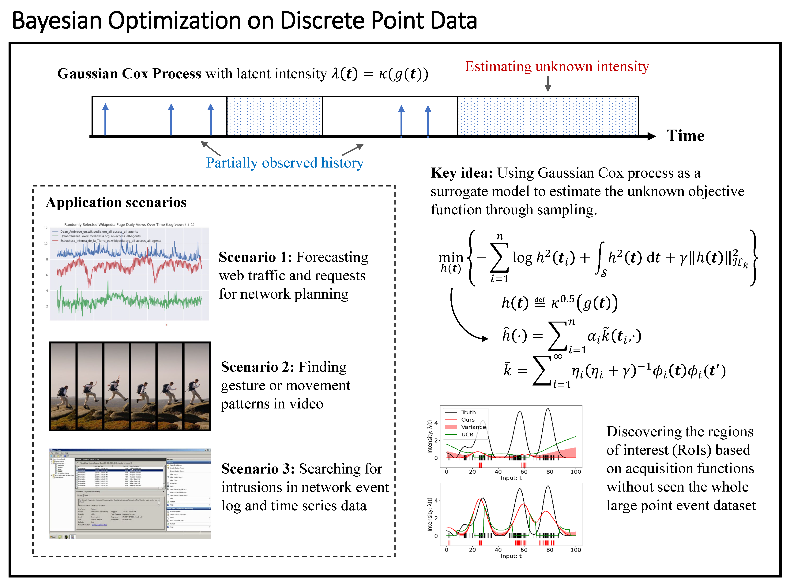

This page includes my projects since 2019.

<b>Table of Contents</b>

<ul>
  <li><a href="#stochastic-process-and-bo">Stochastic process and Bayesian optimization</a>
    <ul>
      <li><a href="#determining-roi-in-discrete-point-data">Determining the region of interest in discrete point data</a></li>
      <li><a href="#unveiling-sub-optimal-solutions-of-an-unknown-function">Unveiling sub-optimal solution of an unknown function</a></li>
    </ul>
  </li>
  <li><a href="#medical-image-segmentation">Medical image segmentation</a>
    <ul>
      <li><a href="#segment-the-precise-brain-tumor-via-attention-to-common-information">Segmenting the precise brain tumor via attention to common information</a></li>
    </ul>
  </li>
  <li><a href="#rl">Reinforcement learning</a>
    <ul>
      <li><a href="#remixing-monotonic-projection-with-theoretic-explanation">Remixing monotonic projection with theoretic explanation</a></li>
      <li><a href="#prioritized-sampling-for-multi-agent-rl">Prioritized sampling for multi-agent RL</a></li>
      <li><a href="#accelerating-multi-agent-rl">Accelerating multi-agent RL</a></li>
    </ul>
  </li>
  <li><a href="#network-security">Network security</a>
    <ul>
      <li><a href="#with-protocol-dialects-a-windtalker">With protocol dialects, a windtalker</a></li>
    </ul>
  </li>
</ul>

# Stochastic process and Bayesian optimization
About [Bayesian optimization](https://en.wikipedia.org/wiki/Bayesian_optimization)

## Determining regions of interest in discrete point data

To determine an optimal solution in the expensive unknown function, general Bayesian optimization methods sequentially sample the space by maximizing an [acquisition function](https://botorch.org/docs/acquisition) defined over the posterior of the [Gaussian process (GP)](https://en.wikipedia.org/wiki/Gaussian_process) model and according to past samples and evaluations. This requires the continuality of the search space so that the GP model can indicate the correlation among input samples. Nevertheless, if our observations are point events (e.g., following a [Poisson process](https://en.wikipedia.org/wiki/Poisson_point_process)), GP cannot perform accurate modeling over those discrete samples.

Therefore, we choose a doubly stochastic point process, the Gaussian [Cox process](https://en.wikipedia.org/wiki/Cox_process) (GCP) with a non-negative smooth [link function](https://en.wikipedia.org/wiki/Generalized_linear_model#Link_function) (connecting the Poisson process with an underlying GP) as the surrogate model for point event intensity to achieve our **point data Bayesian optimization (PDBO)**. We formulate a [Maximum *a posteriori*](https://en.wikipedia.org/wiki/Maximum_a_posteriori_estimation) inference of the functional posterior of latent intensity and solve its mean and covariance via the [Laplace approximation](https://en.wikipedia.org/wiki/Laplace%27s_approximation) and kernel transformation in [reproducing kernel Hilbert space](https://en.wikipedia.org/wiki/Reproducing_kernel_Hilbert_space). On top of that, we consider a wide range of special acquisition functions, such as detecting peak intensity, idle time, [change point](https://en.wikipedia.org/wiki/Change_detection), and cumulative arrivals, through the underlying GCP model to efficiently discover regions of interest (ROIs) in a large discrete point dataset.

  

<i>Fig. Bayesian optimization using Gaussian Cox process model on discrete point data.</i>

<b>Locating high crime rate regions in <a href="https://www.google.com/maps/place/Washington,+DC/@38.8938592,-77.0969765,12z/data=!3m1!4b1!4m6!3m5!1s0x89b7c6de5af6e45b:0xc2524522d4885d2a!8m2!3d38.9071923!4d-77.0368707!16zL20vMHJoNms?entry=ttu">Washington, DC, USA</a></b>

  

<i>Fig. Key step visualization of BO on <a href="https://opendata.dc.gov/datasets/DCGIS::crime-incidents-in-2022/about">2022 DC crime incidents</a> data. Darker red reports regions with higher firearm violence crime rates.</i>

## Unveiling sub-optimal solutions of an unknown function 

Giving up the optimal solution while turning to a sub-optimal one is painful. However, even if finding all or most global optima is desired in many real-world problems that can be seen as [multimodal optimization](https://en.wikipedia.org/wiki/Evolutionary_multimodal_optimization), implementing the optimal solutions is sometimes infeasible due to various practical restrictions, such as resource limitations, physical constraints, etc.

We developed a **multimodal Bayesian optimization (MBO)** framework to locate a set of local/global solutions of a given unknown expensive function. We derive the joint distribution of the objective function and its first-order gradients (that are not considered in standard BO frameworks) and introduce new acquisition functions backed by this joint distribution to decide local optima sequentially during optimization.

  

<i>Fig. Multi-modal Bayesian optimization.</i>

<b><a href="https://www.sfu.ca/~ssurjano/shubert.html">Shubert function</a> animation</b>

  

<i>Fig. Step-wise visualization of MBO on Shubert function.</i>

# Medical image segmentation

## Segmenting the precise brain tumor via attention to common information

The multimodal data allows the identification of correlated information shared by different modalities, i.e., [common information](https://isl.stanford.edu/~abbas/presentations/lect00-viterbi.pdf), thus achieving better representations by the resulting neural networks. From the information theory perspective, the most informative structure between modalities represents the feature representation of one modality that carries the maximum amount of information toward another. To better measure the latent microstructure within the common information, we designed the **partial common information mask (PCI-mask)** to identify the latent partial common information shared by subsets of different modalities in finer granularity. The PCI-mask is optimized online in an unsupervised fashion during the learning.

Besides, we add a [self-attention](https://lilianweng.github.io/posts/2023-01-27-the-transformer-family-v2/#attention-and-self-attention) module that takes the PCI masks and concatenated feature representation of each modality as inputs to obtain the attention feature representation carrying precise partial common information. This module will discriminate different types and structures of partial common information by selectively assigning different attention weights. Thus, utilizing the PCI-mask and self-attention makes our segmentation algorithm more capable of avoiding treating different modalities as equal contributors during training or over-aggressively maximizing the total correlation (e.g., [Hirschfeld-Gebelein-Renyi](https://en.wikiversity.org/wiki/HGR) maximal correlation) of feature representations.

The proposed method optimizes the common information in feature representations of multimodal brain tumor data inputs, which allows precise segmentation with attention to microstructures. The framework is evaluated on the public brain tumor dataset: [Multimodal Brain Tumor Segmentation Challenge](https://www.med.upenn.edu/cbica/brats2020/data.html), where we achieved the [Dice](https://en.wikipedia.org/wiki/S%C3%B8rensen%E2%80%93Dice_coefficient) scores (median) of 0.920, 0.897, 0.837 for the whole tumor, tumor core, and enhancing tumor, respectively.

 **System diagram**

  

<i>Fig. The system architecture (a), Masked Maximal Correlation (MMC) module (b), and Masked Self-Attention (MSA) module (c).</i>

<b>Segmention results</b>

 

  

<i>Fig. Visualization of segmentation results. From left to right, we show axial slices of MRI images in four modalities, predicted segmentation, and ground truth. Labels include ED (cyan), ET (yellow), and NCR/NET (blue) for prediction and ground truth.</i>

# Reinforcement learning

About [reinforcement learning (RL)](https://lilianweng.github.io/posts/2018-02-19-rl-overview/)

## Remixing monotonic projection with theoretic explanation

[Value function factorization](https://arxiv.org/pdf/1706.05296.pdf) is the prevalent approach to dealing with multi-agent RL problems. Many of these algorithms ensure the coherence between joint and local action selections for decentralized decision-making by factorizing the optimal joint action-value function using a monotonic mixing function of agent utilities. Despite this, utilizing monotonic mixing functions also induces representational limitations. We aim to find the optimal projection of an unconstrained mixing function onto monotonic function classes. The results obtained via solving an optimization problem defined as expected return **regret on [QMIX](https://arxiv.org/pdf/1803.11485.pdf) (ReMIX)** provide a theoretic explanation of the optimal projection to the intuitive weight assignment proposed in [WQMIX](https://arxiv.org/pdf/2006.10800.pdf).

<b>Mean reward on <a href="https://arxiv.org/pdf/1910.00091.pdf">Predator-Prey</a></b>

  

<i>Fig. Average reward per episode on the Predator-Prey tasks of four punishment levels.</i>

## Prioritized sampling for multi-agent RL

We formulate a **multi-agent collective prioritization optimization (MAC-PO)** problem and solve it to acquire the optimal weight solution to emphasize the importance of the trajectories. Following the [prioritized experience replay](https://arxiv.org/pdf/1511.05952.pdf) scheme, we extend the prioritized weight assignment to the multi-agent RL scenario, where the agents' individual action-value functions contribute to determining the weights. Specifically, we use several case studies to illustrate our findings.

<b>Win rate on <a href="https://arxiv.org/pdf/1902.04043.pdf">Starcraft Multi-Agent Challenge</a></b>

  

<i>Fig. Comparison between MAC-PO and other adapted experience replay methods on three SMAC maps (from hard to super hard), where MAC-PO outperforms the runner-up by 10%, 6%, and 4% on each map, respectively.</i>

## Accelerating multi-agent RL

The sampling phase matters in off-policy RL, where a batch of transitions is uniformly sampled from the memory replay buffer in normal circumstances. We identified the bottleneck during this sampling stage, and to handle it, we can reuse a set of transitions we have already sampled from the replay buffer. We designed an acceleration framework in multi-agent off-policy RL. This data reuse strategy will **accelerate the multi-agent experience replay (AccMER)** guided by the priority weights.

<b>Illustration of data reuse</b>

  

<i>Fig. Illustration of (a) conventional sampling, where gray-filled boxes denote the uniformly sampled transitions from the replay buffer, and (b) data reuse sampling. In the figure, we sample 50% and reuse the rest of the transitions (reuse ratio = 0.5, batch size b = 6, replay buffer D is a 4×4 matrix), and the number of reuses (time-steps) n = 2. At step T = 1, as the data reuse ratio is 0.5, AccMER selects the first three transitions with the highest weights, and in the next phase, uniform sampling is performed on the remaining three transitions. At step T = 2, the same transition data will be reused, whereas a new set of transitions is sampled randomly. Since n = 2, the reuse-based transition data updates every two steps (e.g., T = 2 and T = 4).</i>

# Network security

## With protocol dialects, a windtalker
What is the protocol dialect? Given a standard communication protocol, a dialect is defined as a variation created by mutating its packets and handshakes while keeping the communication functionalities unchanged. Like two [code talkers](https://en.wikipedia.org/wiki/Windtalkers) on the client and server sides, they speak a specific dialect that is not understandable to outsiders. We design the **[moving target defense](https://csrc.nist.gov/glossary/term/moving_target_defense) with generated protocol dialects (MPD)** to mutate the dialect dynamically for each handshake in a network system. Besides, we incorporated the self-synchronization mechanism (inspired by the [self-synchronizing stream cipher](https://en.wikipedia.org/wiki/Stream_cipher#Self-synchronizing_stream_ciphers) to ensure the synchronization of both sides and minimize the cost when encountering a disaster. All generated protocol dialects are managed through the [consistent hashing](https://en.wikipedia.org/wiki/Consistent_hashing) mapping. The system has been evaluated for multiple common network and [Internet of Things (IoT)](https://en.wikipedia.org/wiki/Internet_of_things) protocols, such as [FTP](https://en.wikipedia.org/wiki/File_Transfer_Protocol), [HTTP](https://en.wikipedia.org/wiki/HTTP), [MQTT](https://en.wikipedia.org/wiki/MQTT), [CAN bus](https://en.wikipedia.org/wiki/CAN_bus), etc.

**System diagram**

  

<i>Fig. MPD system diagram, including Moving Target Customization (MTC), Self-Synchronization Mechanism (SSM), and Protocol Dialect Management (PDM) modules.</i>

<b>Self-synchronization</b>

  

<i>Fig. Self-synchronization mechanism. The system will re-establish the right dialect communication quickly after the disaster happens.</i>

